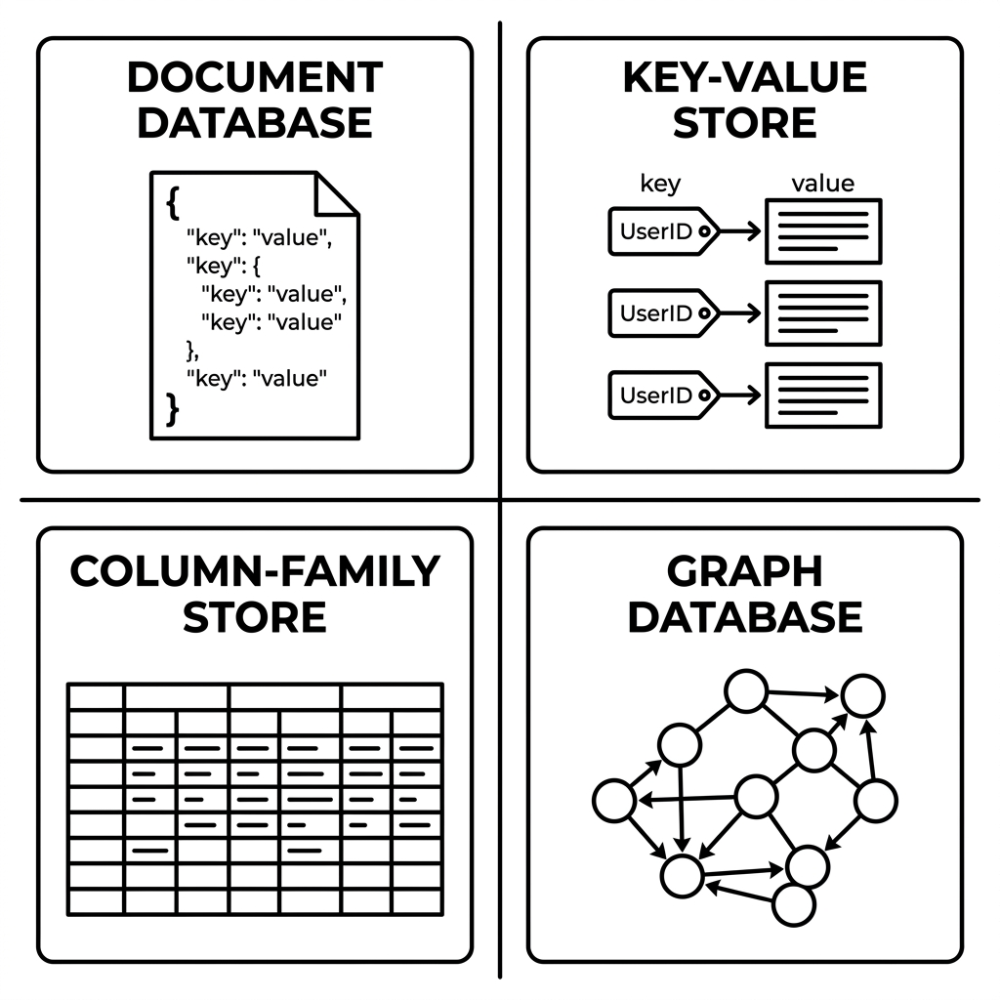
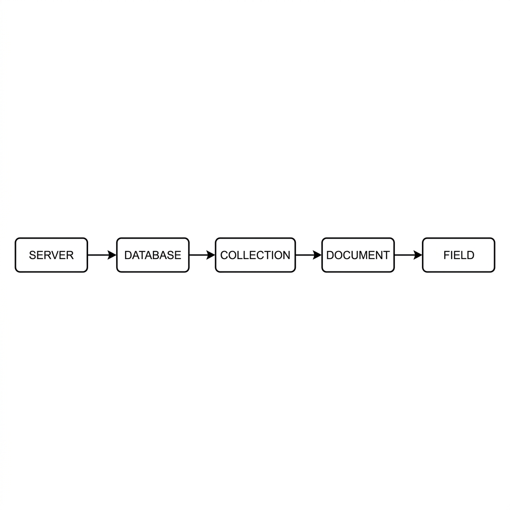
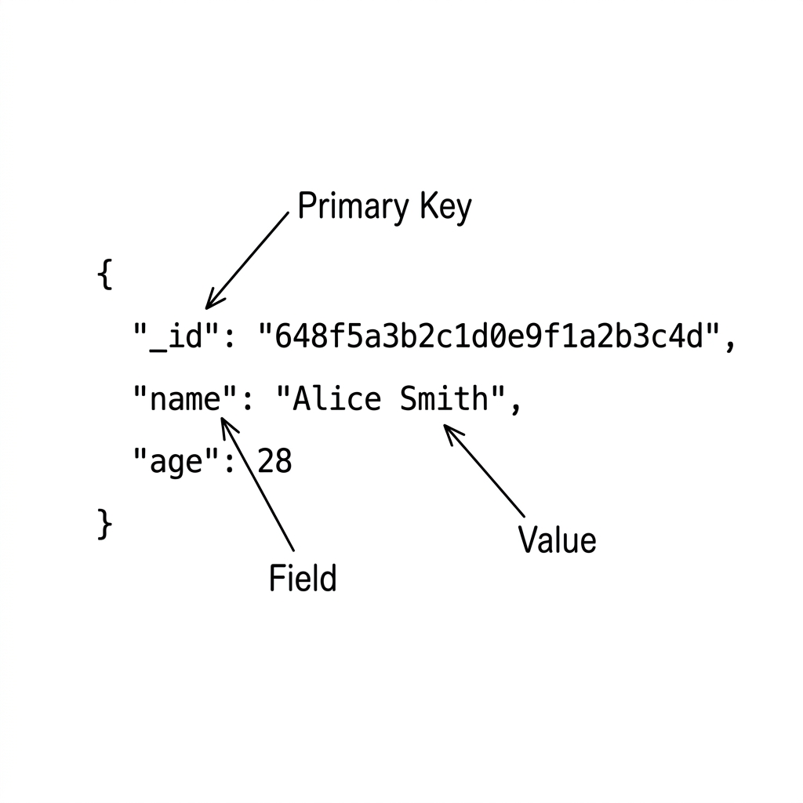
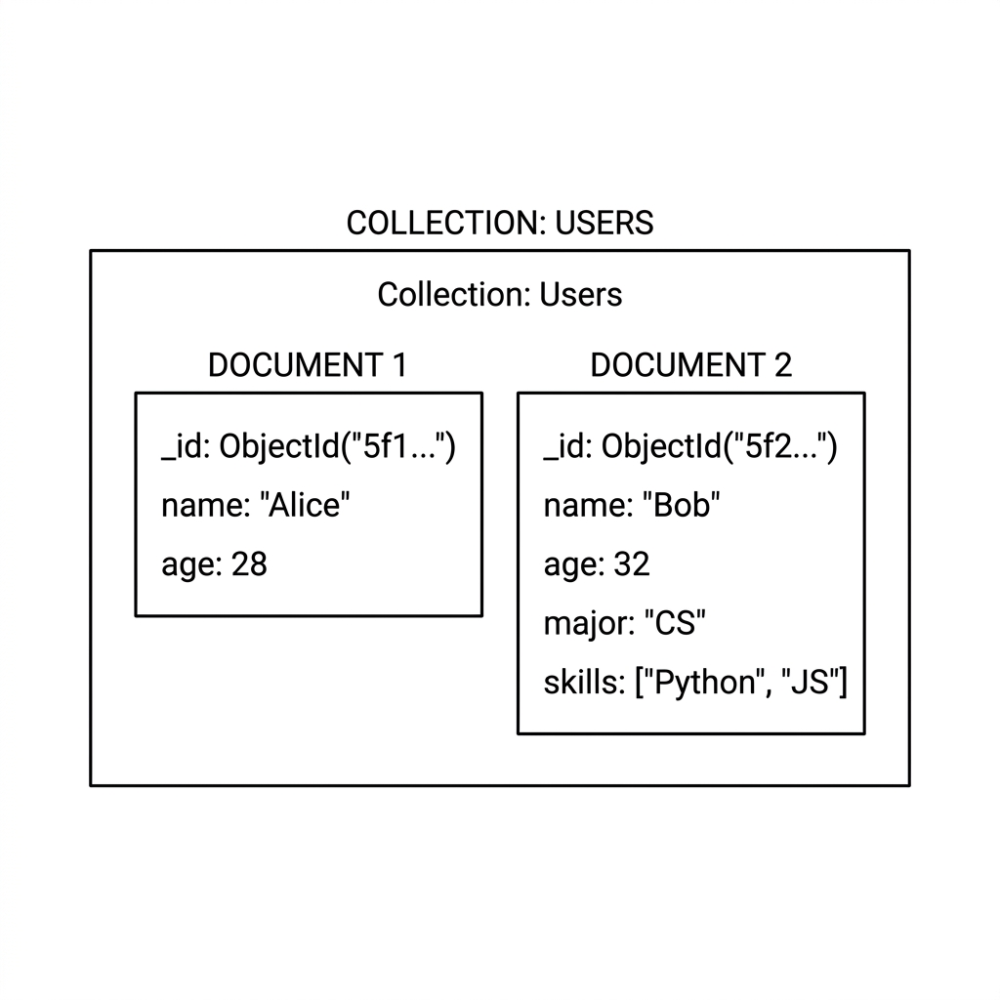
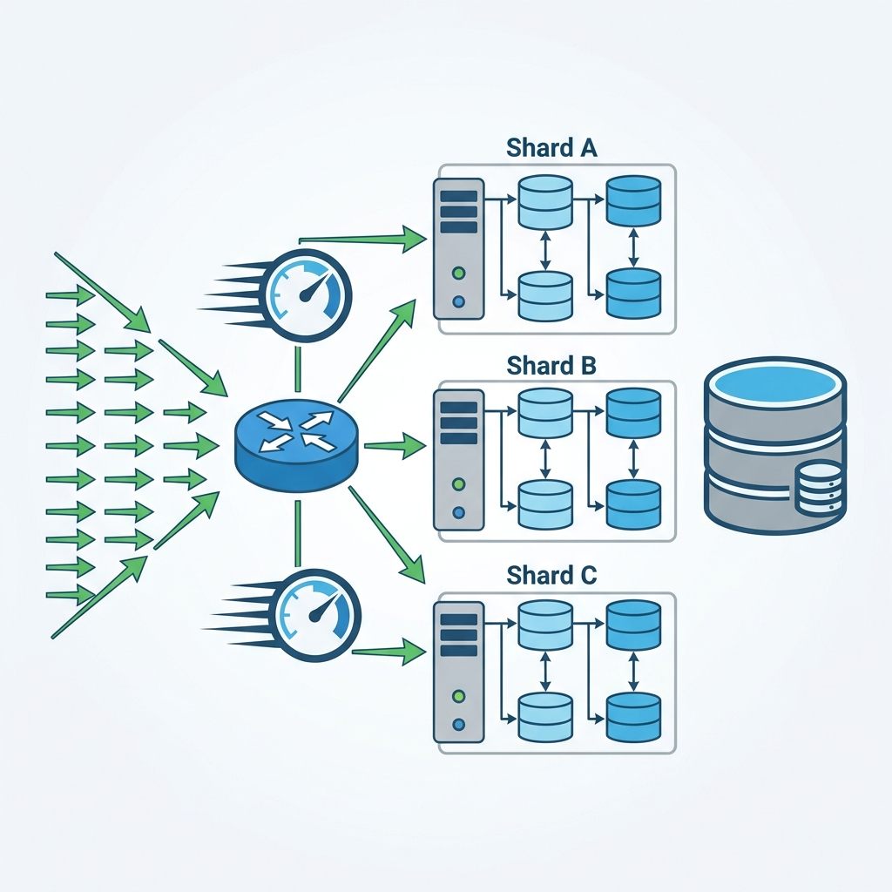
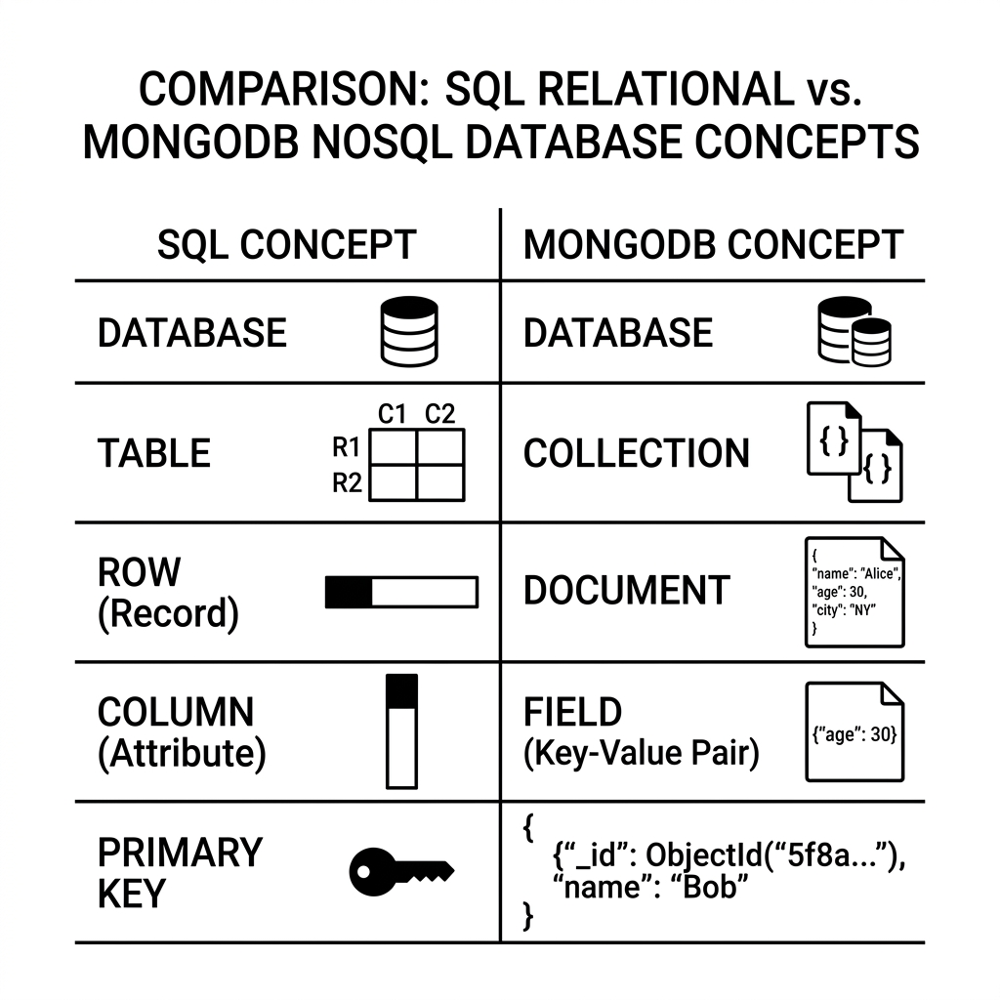

# មេរៀនទី១៖ សេចក្តីផ្តើមអំពី MongoDB

## គោលបំណង

- យល់អំពី MongoDB និង NoSQL
- ស្គាល់ BSON, Document, Collection, Field
- យល់អំពី Schema-less

## 1. MongoDB ជាអ្វី?

MongoDB គឺជា **NoSQL Document Database** ដែលរក្សាទុកទិន្នន័យជា **BSON
Documents** ជំនួស Table និង Row។

## 2. NoSQL

NoSQL មានន័យថា **Not Only SQL** ហើយគាំទ្រការផ្ទុកទិន្នន័យបែប Document,
Key-Value, Graph និង Column Family។



## 3. MongoDB Architecture



```text
Server
 └── Database
      └── Collection
           └── Document
                └── Field
```

## 4. Database

ឧទាហរណ៍៖ - school - shop - company

## 5. Collection

Collection ស្មើនឹង Table ក្នុង SQL។ ឧទាហរណ៍៖ - students - teachers - products

## 6. Document

```json
{
  "_id": "ObjectId(...)",
  "name": "Dara",
  "age": 20,
  "major": "IT"
}
```

## 7. Field

Field គឺជា Key របស់ Document ដូចជា `name`, `age`, `major`។

## 8. BSON

BSON (Binary JSON) គឺជាទម្រង់ដែល MongoDB ប្រើសម្រាប់រក្សាទុកទិន្នន័យ។



## 9. Schema-less

Document ក្នុង Collection តែមួយអាចមាន Field ខុសៗគ្នាបាន។



## 10. Scalability



- ល្បឿនលឿន
- Scale Horizontally
- គាំទ្រ Big Data

## SQL vs MongoDB



SQL MongoDB

---

Database Database
Table Collection
Row Document
Column Field
Primary Key \_id

## Lab

1.  Install MongoDB Community Server
2.  Install MongoDB Compass
3.  Install Mongosh
4.  Create `school` database
5.  Create `students` collection
6.  Insert 5 documents

## Review Questions

1.  MongoDB ជាអ្វី?
2.  NoSQL ជាអ្វី?
3.  BSON ជាអ្វី?
4.  Collection និង Document ខុសគ្នាដូចម្តេច?
5.  Schema-less មានន័យដូចម្តេច?

## Assignment

បង្កើត Database `school` ដែលមាន Collections: - students - teachers -
subjects

បញ្ចូល Document យ៉ាងហោចណាស់ 3 ក្នុង Collection នីមួយៗ។
