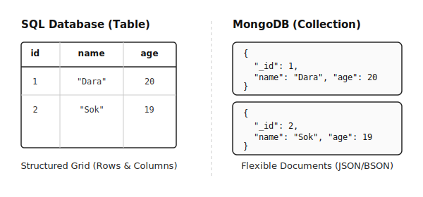
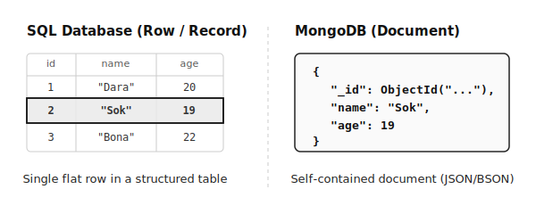
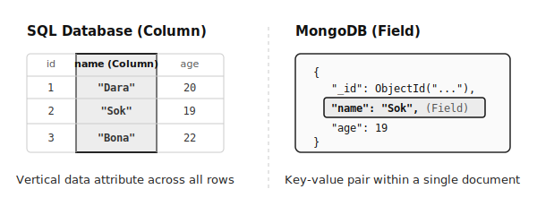
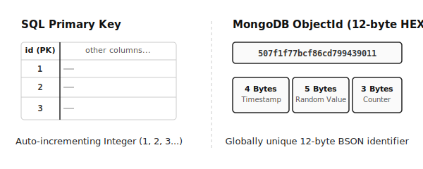
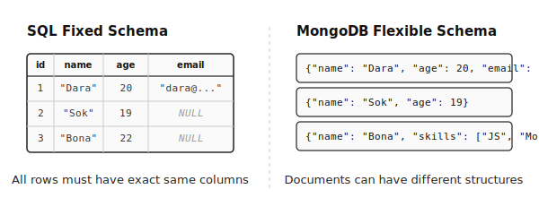
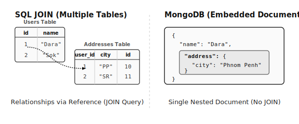
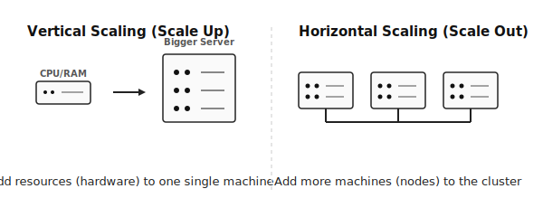

# មេរៀនទី ២៖ ប្រៀបធៀប RDBMS (SQL) និង NoSQL (MongoDB)

## គោលបំណងមេរៀន

- យល់ពីភាពខុសគ្នារវាង SQL និង NoSQL
- ប្រៀបធៀប Table និង Collection
- ប្រៀបធៀប Row និង Document
- យល់ពី Primary Key និង ObjectId
- ដឹងថាពេលណាគួរប្រើ MySQL និង MongoDB

## 1. តើ RDBMS គឺជាអ្វី?

RDBMS (Relational Database Management System) គឺជាប្រព័ន្ធគ្រប់គ្រង Database
ដែលរក្សាទុកទិន្នន័យជា **Table** និងមានទំនាក់ទំនង (Relationship) រវាង Table។

ឧទាហរណ៍៖ - MySQL - PostgreSQL - Oracle - Microsoft SQL Server

## 2. តើ NoSQL គឺជាអ្វី?

NoSQL គឺជាប្រភេទ Database ដែលមិនចាំបាច់ប្រើ Table ដូច SQL ទេ។

MongoDB ប្រើ៖ - Database - Collection - Document

## 3. SQL vs NoSQL

SQL MongoDB

---

Table Collection
Row Document
Column Field
Primary Key ObjectId
Fixed Schema Flexible Schema
JOIN Embedded / Reference
Vertical Scaling Horizontal Scaling

## 4. Table vs Collection



### SQL

```sql
Students Table
id | name | age
1  | Dara | 20
2  | Sok  | 19
```

### MongoDB

```json
{
  "_id": ObjectId(),
  "name": "Dara",
  "age": 20
}
```

## 5. Row vs Document



- SQL: Row = មួយជួរទិន្នន័យ
- MongoDB: Document = ឯកសារ JSON/BSON មួយ

## 6. Column vs Field



- SQL: Column
- MongoDB: Field

## 7. Primary Key vs ObjectId



### SQL

```sql
id INT PRIMARY KEY AUTO_INCREMENT
```

### MongoDB

```json
"_id": ObjectId("...")
```

ObjectId ត្រូវបានបង្កើតដោយស្វ័យប្រវត្តិ និងមានតម្លៃមិនស្ទួន។

## 8. Fixed Schema vs Flexible Schema



### SQL

ត្រូវកំណត់ Schema ជាមុន។

### MongoDB

Document នីមួយៗអាចមាន Field ខុសគ្នាបាន។

## 9. Relationship

MongoDB មាន ២ វិធី៖ 1. Embedded Documents 2. Referenced Documents

## 10. JOIN vs Embedded Document



SQL ប្រើ JOIN។

MongoDB ពេញនិយមប្រើ Embedded Document ដើម្បីបង្កើនល្បឿនអានទិន្នន័យ។

## 11. Vertical Scaling vs Horizontal Scaling



- **Vertical Scaling (SQL)**: បន្ថែមសមត្ថភាព (CPU, RAM, Storage) លើ Server តែមួយ។ មានដែនកំណត់ និងតម្លៃថ្លៃនៅពេលធំខ្លាំង។
- **Horizontal Scaling (MongoDB)**: បន្ថែម Server ច្រើនចូលទៅក្នុង Cluster (Sharding)។ គ្មានដែនកំណត់ និងងាយស្រួលពង្រីក។

## 12. ពេលណាគួរប្រើ SQL?

- Banking System
- Accounting
- ERP
- POS
- Inventory

## 13. ពេលណាគួរប្រើ MongoDB?

- E-Commerce
- Social Media
- Chat Application
- IoT
- CMS
- AI Application
- Big Data

## 14. លំហាត់អនុវត្ត

### MySQL

```sql
CREATE TABLE students(
    id INT PRIMARY KEY AUTO_INCREMENT,
    name VARCHAR(100),
    age INT
);

INSERT INTO students(name, age)
VALUES ('Dara',20), ('Sok',19);
```

### MongoDB

```javascript
use school

db.students.insertMany([
  { name: "Dara", age: 20 },
  { name: "Sok", age: 19 }
]);
```

## សំណួរពិនិត្យ

1.  SQL និង NoSQL ខុសគ្នាដូចម្តេច?
2.  Table និង Collection ខុសគ្នាដូចម្តេច?
3.  Row និង Document ខុសគ្នាដូចម្តេច?
4.  Primary Key និង ObjectId ខុសគ្នាដូចម្តេច?
5.  ពេលណាគួរប្រើ MongoDB?

## សេចក្ដីសង្ខេប

- SQL ប្រើ Table → Row → Column → Primary Key
- MongoDB ប្រើ Collection → Document → Field → ObjectId
- MongoDB មាន Flexible Schema និងសាកសមសម្រាប់ Web, Mobile, Cloud និង Big
  Data។
