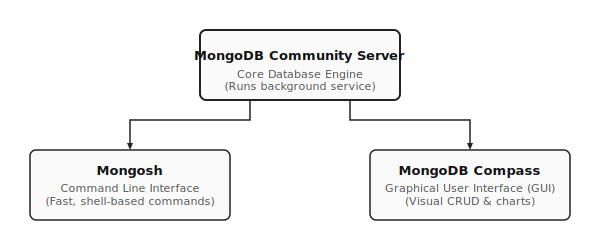
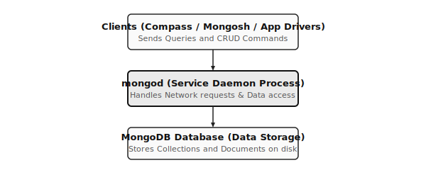
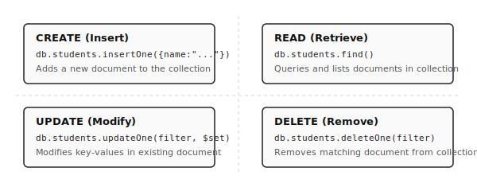

# មេរៀនទី៣៖ ការដំឡើង និងការប្រើប្រាស់ MongoDB (MongoDB Installation & Getting Started)

## គោលបំណងមេរៀន

- យល់អំពី MongoDB Community Server
- យល់អំពី MongoDB Compass
- ប្រើប្រាស់ Mongosh
- បង្កើត Database និង Collection
- អនុវត្ត CRUD

---

# 1. MongoDB Ecosystem



## MongoDB Community Server

- Database Server ដែលរក្សាទុកទិន្នន័យ
- Query data
- បង្កើត Database និង Collection

## MongoDB Compass

GUI សម្រាប់គ្រប់គ្រង MongoDB។ អាច៖ - View Database - Insert/Edit/Delete
Documents - Run Query - Create Index

## Mongosh

Command Line Shell សម្រាប់ MongoDB។

```bash
mongosh
```

```javascript
use school
db.createCollection("students")

db.students.insertOne({
  name:"Dara",
  age:20
})

db.students.find()
```

## mongod Service

`mongod` គឺជា Database Server Process។



Windows

```powershell
net start MongoDB
net stop MongoDB
```

## បង្កើត Database

```javascript
use school
show dbs
```

បន្ទាប់ពី Insert Data:

```javascript
db.students.insertOne({name:"Dara"})
show dbs
```

## បង្កើត Collection

```javascript
db.createCollection("students")
show collections
```

## CRUD



```javascript
// Create
db.students.insertOne({ name: "Dara", age: 20 });

// Read
db.students.find();

// Update
db.students.updateOne({ name: "Dara" }, { $set: { age: 21 } });

// Delete
db.students.deleteOne({ name: "Dara" });
```

# Lab

```javascript
use school

db.createCollection("students")

db.students.insertMany([
 {name:"Dara",age:20},
 {name:"Sokha",age:21},
 {name:"Vanna",age:19}
])

db.students.find()

show dbs
show collections
```

# សង្ខេប Component

---

MongoDB Community Server Database Server
MongoDB Compass GUI
Mongosh Command Line
mongod MongoDB Service
Database ផ្ទុក Collections
Collection ផ្ទុក Documents
Document JSON/BSON Data

# សំណួរ

1.  MongoDB Compass គឺជាអ្វី?
2.  Mongosh ប្រើសម្រាប់អ្វី?
3.  `mongod` មានតួនាទីអ្វី?
4.  បង្កើត Database ដោយរបៀបណា?
5.  Collection ខុសពី Database ដូចម្តេច?
6.  `show dbs` និង `show collections` ប្រើសម្រាប់អ្វី?
7.  សរសេរ Command ដើម្បី Insert Document មួយ។
