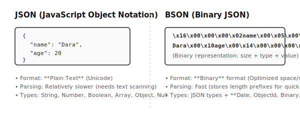
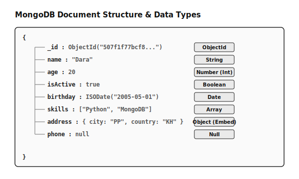

# មេរៀនទី៤៖ Data Types នៅក្នុង MongoDB

## គោលបំណងមេរៀន

បន្ទាប់ពីរៀនចប់ អ្នកនឹងអាច៖

- ស្គាល់ Data Types របស់ MongoDB
- យល់ពី BSON
- ប្រើ ObjectId
- បង្កើត Document ដែលមាន Data Types ផ្សេងៗ
- ជ្រើសរើស Data Type ឱ្យសមស្រប

---

# JSON និង BSON

MongoDB រក្សាទុកទិន្នន័យជា **BSON (Binary JSON)**។



---

# MongoDB Data Types

| Data Type | Example |
|-----------|---------|
| String | `"Dara"` |
| Number | `20`, `3.8` |
| Boolean | `true`, `false` |
| Date | `ISODate()` |
| Array | `["Python","MongoDB"]` |
| Object | `{ "city":"Phnom Penh" }` |
| ObjectId | `ObjectId()` |
| Null | `null` |

---

# 1. String

```javascript
{
  "name": "Sok"
}
```

ប្រើសម្រាប់ ឈ្មោះ Email Phone និង Address។

---

# 2. Number

```javascript
{
  "age": 20,
  "price": 950,
  "gpa": 3.75
}
```

---

# 3. Boolean

```javascript
{
  "isActive": true,
  "paid": false
}
```

---

# 4. Date

```javascript
{
  "created_at": new Date()
}
```

---

# 5. Array

```javascript
{
  "skills": ["Python", "Flask", "MongoDB"]
}
```

---

# 6. Object (Embedded Document)

```javascript
{
  "address": {
    "city": "Phnom Penh",
    "country": "Cambodia"
  }
}
```

---

# 7. ObjectId

```javascript
{
  "_id": ObjectId(),
  "name": "Dara"
}
```

MongoDB បង្កើត `_id` ដោយស្វ័យប្រវត្តិ។

---

# 8. Null

```javascript
{
  "phone": null
}
```

---

# Document Example

```javascript
{
  "_id": ObjectId(),
  "name": "Dara",
  "age": 20,
  "gpa": 3.85,
  "isActive": true,
  "birthday": new Date("2005-05-01"),
  "skills": ["Python","Flask","MongoDB"],
  "address": {
    "city": "Phnom Penh",
    "country": "Cambodia"
  },
  "phone": null
}
```

---

# Diagram



---

# Lab

## បង្កើត Database

```javascript
use school
```

## បង្កើត Collection

```javascript
db.createCollection("students")
```

## Insert Document

```javascript
db.students.insertOne({
  name:"Dara",
  age:20,
  gpa:3.8,
  isActive:true,
  birthday:new Date("2005-01-10"),
  skills:["Python","MongoDB"],
  address:{
    city:"Phnom Penh",
    country:"Cambodia"
  },
  phone:null
})
```

## Query

```javascript
db.students.find()
```

---

# សំណួរពិនិត្យ

1. BSON ខុសពី JSON ដូចម្តេច?
2. ObjectId មានតួនាទីអ្វី?
3. Embedded Document គឺជាអ្វី?
4. Array អាចផ្ទុកទិន្នន័យប្រភេទអ្វីខ្លះ?
5. តើ MongoDB មាន Data Types អ្វីខ្លះ?

---

# សង្ខេប

MongoDB ប្រើ BSON ដើម្បីរក្សាទុកទិន្នន័យ និងគាំទ្រ Data Types ជាច្រើនដូចជា String, Number, Boolean, Date, Array, Object, ObjectId និង Null។ ការយល់ដឹងអំពី Data Types ជាមូលដ្ឋានសំខាន់សម្រាប់ការសរសេរ Query និងរចនា Database។
